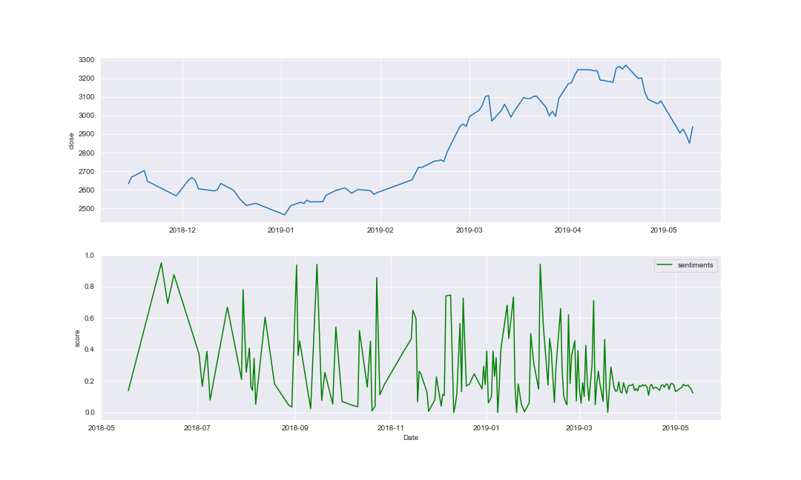
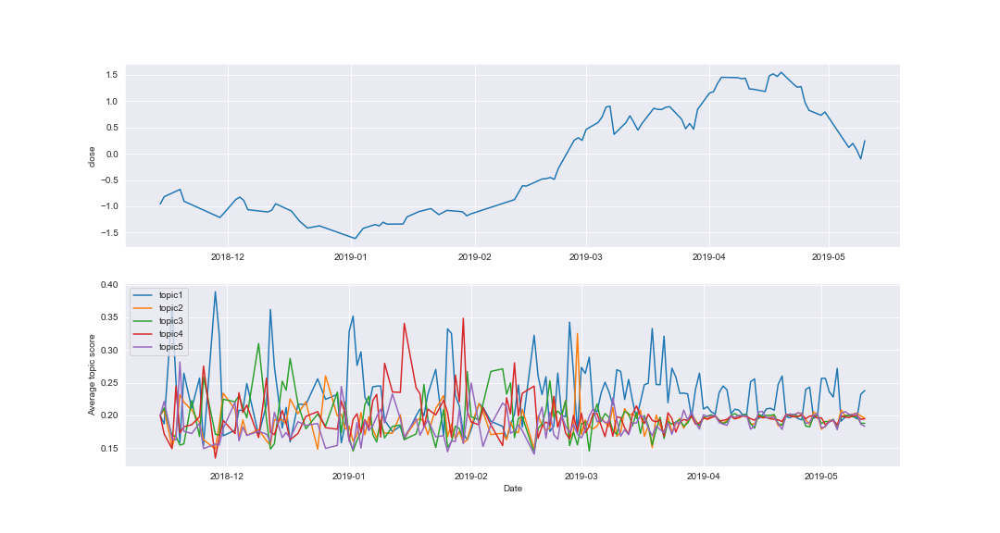
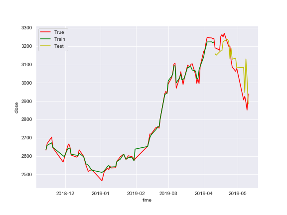
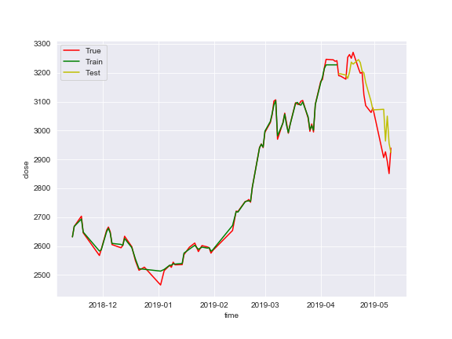

# TextBasedStockForecasting

股价预测是许多投资者都比较关心的问题，使用传统的方法的预测精度有限，因此考虑加入一些外部信息，比如新闻，评论等，之后提取文本的特征，为预测提供辅助信息，以提高预测精度。

外部信息主要考虑新闻和评论，目前选择评论数据，主要原因是新闻仅是事件的客观陈述，没有反应预期。而股民的评论则既受事实的影响，包含客观信息，又能反应股民的情绪，包含股民预期信息。应该能够提供更多有价值的特征。

## 数据准备

### 数据获取
- 评论数据：从东方财富网站股吧板块爬取了近一年上证股指下的吧评数据，包含时间，链接，标题，内容，作者等信息。
- 股价数据：股票价格信息通过tushare包拉取。

### 数据预处理

常规的去除停用词、标点、特殊符号，分词操作。值得一提的是在分词时可以加载搜狗专用领域的细胞词库，使得分词效果更好。

## 指标部分：

对爬取的数据：
- 进行情感分析，得到每天的情绪指标
   - 考虑将每天的评论数据的情绪进行直接平均，这样做的问题是，正负抵消的现象非常强，导致文本的情绪极性被很大的削弱了。
   - 针对这一问题，给出的解决方案是将情绪得分按多数平均，不是一起平均，以凸显大众心理。
   - 下图是情感与股价的折线图
   
- 建立主题模型，计算每天的每条新闻属于多个主题的概率，同样需要考虑如何将一天中的多条新闻的概率聚合起来形成这一天的主题概率，目前仍然考虑简单平均。
- 下图是主题与股价的折线图

## 特征工程

计算出了每天的情绪和主题后，假如有k个主题，加上情绪得分字段我们可以得到k+1个自变量了，再加上时间序列本身的历史值，目前有k+2个自变量。但是这些自变量不能直接用，需要有两天的时间偏移。即我们在`今天`要预测`明天`的股价，拿的是`前天`的数据去预测而不是今天的数据，在训练的时候也是如此。

具体做法：
- 在第t天，计算上述每个指标的前2天，前7天，前14天，前30天，前45天，前60天（注：第t天的前…天包含第t天在内）的均值，中位数，标准差，t从数据集第60天开始取到结束。
注：计算的时候包含第t天，则第t天得到的这些特征只能当作第t+2天的特征。

## 建模预测

### 模型一
- 上述过程产生了 6\*3\*(k+1) 个特征，用这些特征拟合一个机器学习模型，目前尝试过SVM以及Decision Tree，发现单个模型过拟合现象十分严重，训练集完美拟合，但是在测试集的泛化能力十分差，于是考虑集成模型GBDT，这一现象有所改善，但是由于数据集太小，无法完全解决这一问题。
- 为了比较添加文本信息和不添加文本信息的效果，下面绘制了两幅比较图，上侧为没有文本信息的预测效果，下侧为添加文本特征后的预测效果，结果显示，文本特征的加入能够使得预测的效果更加稳健。
<figure class="half">
    
    
</figure>

### 模型二
- 不用特征，单纯使用arima拟合一个传统的模型
